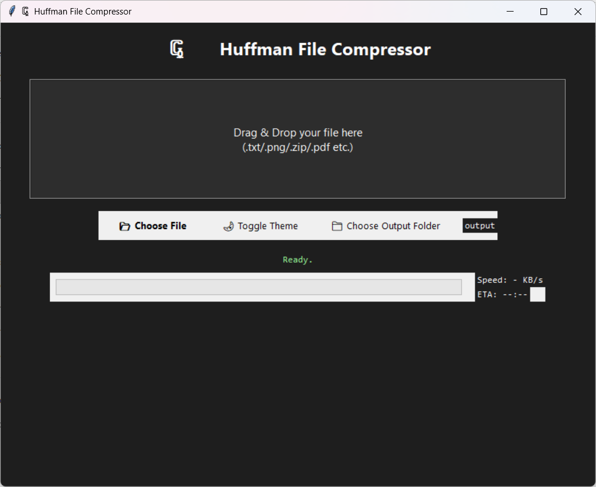

<h1 align="center">🗜️ Huffman File Compressor</h1>

A modern, GUI-based Huffman coding application for file compression and decompression.
Supports any file type — text, image, archive, or binary — and provides a real-time progress bar, ETA, speed, and compression ratio graph.

---

## ✨ Features

🧩 **Binary-Safe Compression** — works with .txt, .png, .zip, .pdf, .exe, etc. 

🖱️ **Drag & Drop GUI** — simple interface built with TkinterDnD. 

⚙️ **Configurable Output Folder** — choose where to save results. 

🌗 **Light / Dark Theme toggle** 

📊 **Compression Graph** — see size reduction visually. 

🚀 **Real-Time Progress Bar with ETA & speed indicator** 

💾 **Single Executable Build** — make your own .exe with PyInstaller. 

---

## ⚙️ Installation & Usage (Run via Terminal)
### 🪄 Step 1 — Clone the repository
'git clone https://github.com/PritamSarma/huffman_compressor.git
cd huffman-compressor'

### 🪄 Step 2 — Install dependencies
'pip install -r requirements.txt'

### 🪄 Step 3 — Run the GUI
'python gui.py'

That’s it! 🎉 
The graphical interface will launch — just drag & drop any file or choose it manually.

---
## 🪄 Example Run
### 🧱 Compress a file:
python gui.py 

→ Drag a file like photo.png 
→ Watch progress, ETA, and compression graph 
→ Output saved as photo.huff 

### 🧩 Decompress a file:

→ Drag photo.huff 
→ Restores as photo_out.png 

---

## ⚡ Building a Standalone .exe (Optional)

You can bundle this app into a single Windows executable that runs without Python.

### Step 1 — Install PyInstaller
'pip install pyinstaller'

### Step 2 — Build the executable
'pyinstaller --noconsole --onefile --icon=icon.ico gui.py'

### ✅ This creates:

dist/gui.exe

Double-click it — the full app launches instantly with no terminal window. 

---

## 🧩 Supported File Types
| Type | Example |
|------|---------|
| Text |	.txt, .csv, .json, .xml, .py |
| Image |	.png, .jpg, .bmp |
| Archive |	.zip, .tar, .gz |
| Document |	.pdf, .docx |
| Binary |	.exe, .bin, .dll |
| Audio |	.mp3, .wav |

✅ Works with any binary data.

---
## 🧠 Algorithm Used  

This project implements Huffman Coding, a fundamental lossless data compression algorithm that assigns shorter codes to frequent bytes and longer codes to rare ones, minimizing total file size.

---
## 📸 Screenshot

---

## 🧾 License

This project is licensed under the MIT License. 

Feel free to modify, share, and distribute. 

---

## ❤️ Credits

Developed by Pritam Sarma 
If you like this project, ⭐ star it on GitHub 
 — it helps a lot!